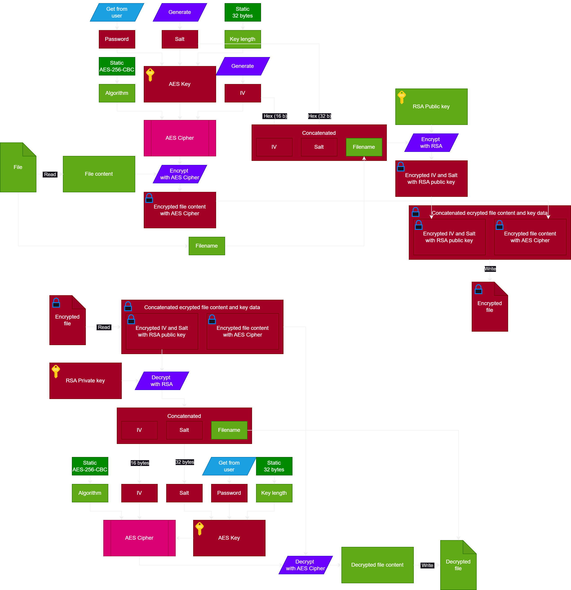

# Cryptone
### Priorities (GitHub issues):
- 🔴 Critical: Requires immediate attention and resolution. These tasks are blocking or essential for the core functionality of the project.
- 🟠 High: Important tasks that should be addressed after resolving critical issues. These significantly impact user experience or key features.
- 🟡 Medium: Moderate priority tasks. While not urgent, they are important for the project's overall quality and progression.
- 🟢 Low: Minor tasks or enhancements. These can be addressed when higher-priority issues are resolved.
- 🔵 Optional: Tasks that are not essential. They can be addressed if time permits but have minimal impact on the project.
- 🟣 Lowest Priority: Non-essential or purely cosmetic tasks. These can be considered only if all other priorities are completed and there is additional time or interest.

## Run locally
### Prerequisites
- nodejs v22

### 1. Install packages
```shell 
  npm install 
```

### 2. Build 
```shell
  npm run build
```

### 2. Start
```shell
  npm run start
```

## Build executables
For Windows:
```shell
  electron-builder --win
```
or
```shell
  npx electron-builder -w
```

## Encrypting logic

